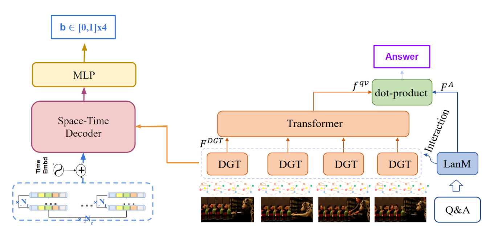
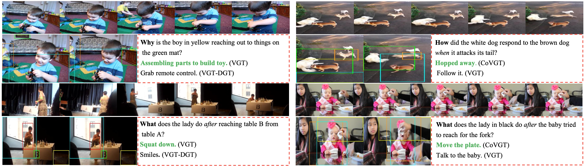

# Spatio Video Grounding via Graph Transformer

## Background and Motivation
This work extends an existing video QA system, <a href="https://arxiv.org/abs/2302.13668">CoVGT</a>, by incorporating a space-time decoder specifically tailored for spatial localization. CoVGT adopts a graph-based representation for video elements, treating them as nodes and edges to capture dynamic interactions among objects for effective video reasoning. The use of graph transformers on nodes and edges enables the model to derive informative temporal relations across different timestamps. Their innovative approach to video question answering using graph neural networks motivated us to embark on this project.


** Note: The space-time decoder is inspired by <a href="https://arxiv.org/abs/2203.16434">TubeDETR</a>.

</br>
Our contributions are the following:  

* Manipulating STAR dataset annotations to present a single location as the visual gt answer.
* Parsing STAR dataset to filter out questions containing non-object answers given the questions template.
* Adding a space-time decoder to model spatial interaction over the entire video.


<div align="center">
  
</div>

## Setup
Assume you have installed Anaconda3, cuda version > 11.0 with gpu memory >= 24G, please do the following to setup the envs:
```
>conda create -n vqa python==3.8.18
>conda activate vqa
>git clone https://github.com/kimiaf1998/C_CoVGT.git
>conda install pytorch torchvision torchaudio pytorch-cuda=11.8 -c pytorch -c nvidia
>pip install -r requirements.txt
```
## Dataset 

### Annotations
Please download the videos from this <a href="https://ai2-public-datasets.s3-us-west-2.amazonaws.com/charades/Charades_v1_480.zip">link</a>.
New annotations are stored in ```/datasets/STAR/``` directory. ```train.json``` and ```val.json``` are the finalized annotations for the train and validation sets. Since the STAR dataset doesn't provide a test set, we use the validation set as the test set. ```clips_train.json``` and ```clips_val.json``` show the mapping of the sampled frames for each data point (question corresponding to a video). These sampled frames ensure that we have the frames containing the visual answer for every question.
```vid_fps_mapping.json``` also indicates the mapping of fps to each video.


### Features
Please download the pre-extracted video features from <a href="https://ai2-public-datasets.s3-us-west-2.amazonaws.com/charades/Charades_v1_480.zip">link</a>. The frame features are stored in ```frame_feat``` and regional features in ```bbox```. The pre-extracted regional features hold the top 10 confident features. To extract frame-wise features, use ```tools/preprocess_feature.py``` and for regional features, use the provided tool in <a href="https://github.com/MILVLG/bottom-up-attention.pytorch">BUA<a>.


## Demo

Run the following command to infer and visualize results on any video of the STAR dataset. You may want to change the video information.
```
./shells/star_demo.sh 0
```

## Train
To train the model, use the train script provided in the folder 'shells' and run it by specifying the GPU IDs behind the script. (If you have multiple GPUs, you can separate them with a comma: ./shell/star_train.sh 0,1)
```
./shell/star_train.sh 0
```
It will train the model and save it to the folder 'workspace/save_models/STAR/CoVGT/'. 

Some useful args:
Set
* ```--bnum``` to the number of object queries.
* ```--mc``` to the number of multiple-choices.
* ```--qmax_words``` and ```--amax_words``` to the number of maximum questin and answer tokens respectively.
* ```--video_max_len``` to the number of frames to sample from each video.
* ```--bbox```, ```--giou_loss_coef``` and ```--cl_loss``` to the appropriate weight for each loss contribution. 


## Results
**<p align="center">Table 1. VideoQA Accuracy (%) on Test Set.</p>**
<table>
  <tr>
    <th>Cross-Modal Pretrain</th>
    <th><a href="https://github.com/doc-doc/NExT-QA", target="_blank">NExT-QA</a></th>
    <th><a href="https://github.com/bcmi/Causal-VidQA", target="_blank">Causal-VidQA</a></th>
    <th><a href="https://bobbywu.com/STAR/">STAR</a></th>
    <th><a href="https://github.com/YunseokJANG/tgif-qa", target="_blank">TGIF-QA</a> (Action)</th>
    <th>TGIF-QA (Trans)</th>
    <th>TGIF-QA (FrameQA)</th>
    <th>TGIF-QA-R* (Action)</th>
    <th>TGIF-QA-R* (Trans)</th>
    <th><a href="https://github.com/xudejing/video-question-answering">MSRVTT-QA</a></th>
  </tr>
  <tr>
    <td>-</td>
    <td>59.4</td>
    <td>59.1</td>
    <td>44.0</td>
    <td>94.7</td>
    <td>97.6</td>
    <td>61.6</td>
    <td>60.8</td>
    <td>73.8</td>
    <td>38.3</td>
  </tr>
  
  <tr>
    <td><a href="https://drive.google.com/file/d/18KUgq22hLRmRfCgfMf_TXRgjCt3NE8vO/view?usp=sharing">WebVid0.18M</a></td>
    <td><a href="https://drive.google.com/file/d/1Udhm0BdD_YgcrLZ7RwMXwkKGlW-vHo7H/view?usp=sharing">59.7<a></td>
    <td>60.8</td>
    <td>46.2</td>
    <td>91.3</td>
    <td>96.2</td>
    <td>61.7</td>
    <td>61.0</td>
    <td>73.2</td>
    <td>40.0</td>
  </tr>
  <tr>
   <td>-</td>
    <td><a href="https://drive.google.com/file/d/19TRupHHAP9m0eE9n3b2HMcliiJE9VGcN/view?usp=sharing">feats</a></td>
    <td>feats</td>
    <td>feats</td>
    <td>feats</td>
    <td>feats</td>
    <td>feats</td>
    <td>feats</td>
    <td>feats</td>
    <td><a href="https://drive.google.com/file/d/14efO-eeYFSKKPhhG3AUqJLOONm80xDo8/view?usp=sharing">feats</a></td>
  </tr>
  <tr>
    <td>-</td>
    <td><a href="https://drive.google.com/file/d/1jTcRCrVHS66ckOUfWRb-rXdzJ52XAWQH/view?usp=sharing">videos</a></td>
    <td>videos</td>
    <td>videos</td>
    <td>videos</td>
    <td>videos</td>
    <td>videos</td>
    <td>videos</td>
    <td>videos</td>
    <td>videos</td>
  </tr>
  <tr>
    <td>-</td>
    <td><a href="https://github.com/doc-doc/CoVGT/tree/main/datasets/nextqa">Q&A</a></td>
    <td><a href="https://drive.google.com/file/d/1XLPiVY72GV0NYXGNR32wNQQMRe1J-33E/view?usp=sharing">Q&A</a></td>
    <td><a href="https://drive.google.com/file/d/16GBhLrtDooB4DbKgwgERY_XvfUQ-9p8J/view?usp=sharing">Q&A</a></td>
    <td><a href="https://drive.google.com/file/d/1CE04mDGiQ2EcG5zbQAgERi-EukiIPKSw/view?usp=sharing">Q&A</a></td>
    <td>Q&A</td>
    <td>Q&A</td>
    <td><a href="https://drive.google.com/file/d/1arKsPSkx9DwlX1SpP_qoh30PgfgitKQv/view?usp=sharing">Q&A</a></td>
    <td>Q&A</td>
    <td><a href="https://drive.google.com/file/d/1vstHqtgZQBkPzzRTZo-Nb15rAQ4b7gOl/view?usp=sharing">Q&A</a></td>
  </tr>
</table>
(The feature files are identical to VGT. We have merged some files of the same dataset to avoid too many links.)

### Result Visualization
<div align="center">
  
</div>

## Citations 
```
@ARTICLE {xiao2023contrastive,
author = {J. Xiao and P. Zhou and A. Yao and Y. Li and R. Hong and S. Yan and T. Chua},
journal = {IEEE Transactions on Pattern Analysis &amp; Machine Intelligence},
title = {Contrastive Video Question Answering via Video Graph Transformer},
year = {2023},
volume = {45},
number = {11},
issn = {1939-3539},
pages = {13265-13280},
doi = {10.1109/TPAMI.2023.3292266},
publisher = {IEEE Computer Society},
address = {Los Alamitos, CA, USA},
month = {nov}
}
```
## Notes
If you use any resources from this repo, please kindly star our repo and acknowledge the source.
